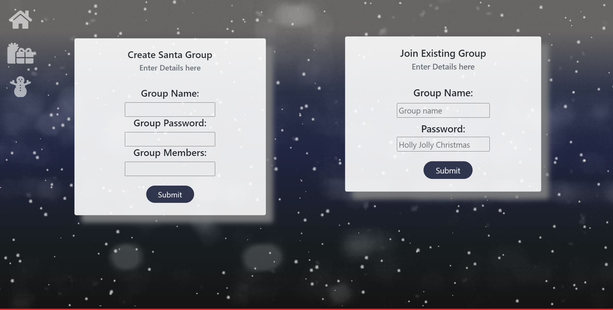
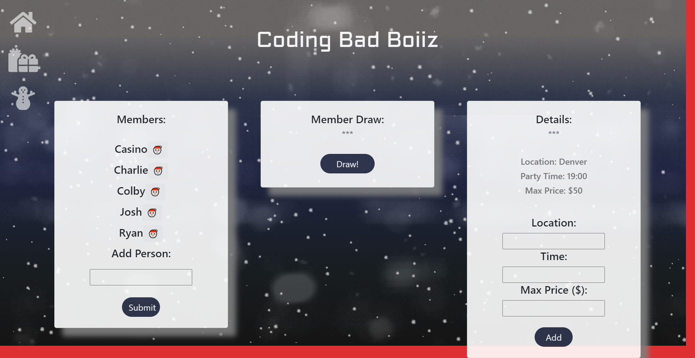

# Project 3 Naughty and Nice
 

## Info: 
Create a white elephant group or you can join an existing group. After you create or join a group you are redirected to the main page where you can add members of your group, after you add the members you can hit the draw button on the center card and all of the members names will be on the left side and the person they are assigned to will be on the right side. On the main page you can also add the location of the party, the time of the party and the maximum spending limit allowed. 

## Table of Contents 
[Installation](#Installation) || [Usage](#Usage) || [License](#License) || [Contributing](#Contributing) || [Tests](#Tests) || [Questions](#Questions)

### Installation:
Application is hosted on heroku at https://naughty-and-nice.herokuapp.com/

### Usage:
Select the Heroku link listed in the Installation section, above. In the Naughty and Nice browser page, the user may create or join an existing group. You can add members, draw the names to be assigned your white elephant partner and you can add a description for your party. 

#### Landing Page:

##### Main Page:

### License:
 This project is licensed under the MIT license.

### Contributing:
Please contribute to enhance the functionality of this code with authentication and a wishlist database. Please adhere to the Code of Conduct for the Contributor Covenant, version 2.0, at https://www.contributor-covenant.org/version/2/0/code_of_conduct.html.

### Questions:
To contact the authors of this repository, reach them via: 

Github: https://github.com/casinoapte       
Email:  casino.apte@gmail.com

Github: https://github.com/heychuck11   
Email:  chuckhoward99@gmail.com

Github: https://github.com/ctrahan94  
Email:  colby.trahan1229@gmail.com

Github: https://github.com/Laika-Beats  
Email:  laikabeatsdenver@gmail.com

Github: https://github.com/ryanwit  
Email:  ry.witherspoon@gmail.com